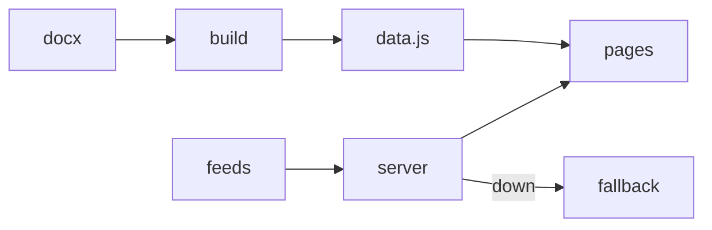
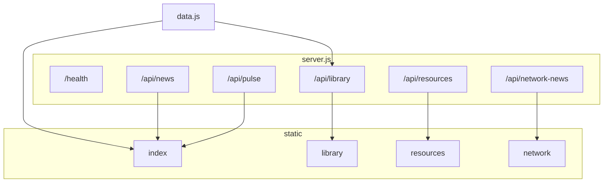

*Illustration: a mentor and a learner hunting through a paper map of Thailand at one desk. One Mac, rain on a Bangkok window. The drawing has no title card — the method is in this repo.*

# Tech Hunt Thailand

**ไดเรกทอรีเมืองอัจฉริยะ · A searchable civic-tech directory from a program report.**

[](LICENSE)
[](package.json)
[](https://github.com/Nonarkara/techhuntthailand/actions/workflows/ci.yml)

[How to use](#how-to-use--learn) · [System diagram](#system-diagram) · [Contributing](CONTRIBUTING.md)

By [Non Arkaraprasertkul](https://github.com/Nonarkara) (Nonarkara) — [Axiom X Co., Ltd.](https://axiom.nonarkara.org), Bangkok. Written for a **Thai–English** learner audience. The shipped UI also has Mandarin (`zh`) because that is what is in `app.js` / `site-pages.js`. This is independent studio software. It is **not** an official depa, Smart City Thailand Office, ASEAN, or municipal product.

Static Pages surface documented on this repository: [nonarkara.github.io/techhuntthailand](https://nonarkara.github.io/techhuntthailand/). That build is the HTML/CSS/JS bundle. Live RSS and pulse JSON need the Node server in `server.js` (local `npm start`, or the Render service named in `render.yaml`).

---

## What this is

A public **directory hub** that turns one research Word file into a page you can search, filter, and share.

The generator `scripts/build_directory_data.py` reads `รายงาน Technology Stock.docx` and writes `data.js`. The last committed generate (`data.js` meta `2026-03-04`) holds **160** solutions, **156** organizations, **7** smart domains, and **5** program cohorts. Those numbers are counts in the generated file, not a live census and not a ranking.

What ships in this tree:

| Surface | Files | Role |
| --- | --- | --- |
| Overview | `index.html` + `app.js` + `data.js` | Searchable directory, domain filters, CSV export, shareable query state |
| Pulse | `live-pulse.js` + `/api/pulse` | Map + five city anchors (Bangkok, Chiang Mai, Khon Kaen, Phuket, Hat Yai) + earthquake context |
| News | `/api/news` | TechCrunch startups RSS + Google News government query, with fallback JSON |
| Library | `library.html` + `/api/library` | Pillars, domains, and tracks from `data.js` |
| Resources | `resources.html` + `/api/resources` | Named public sources and in-repo page links |
| Ecosystem news | `network-news.html` + `/api/network-news` | Google News mention feed, with fallback JSON |

The UI is trilingual (`en` / `th` / `zh`). Partner marks on the overview (depa, SLIC Thailand, UWN, KMITL) are on-page credits. They do not make this GitHub project an official agency product.

**This repo is not:**

- A city ranking or a scored index. Sort options are curated order, name, organization, or verified-site-first — not a black-box score.
- A live procurement catalogue. Website cells are either a stored URL or a search fallback (`data.js` last generate: 64 verified / 96 search routes).
- A hosted SaaS. There is no secret API key in this tree. Pulse and news degrade to fallback payloads when upstreams fail.

---

## Philosophy

Four studio tenets. They are how this repo is meant to be forked, not slogans.

**Fork the method, not the secrets.** The method is report → generator → `data.js` → static pages, plus a small Node process that fetches public feeds and **says so** when it cannot. There are no tokens to copy. If a learner needs a private key to open the directory, the system failed.

**One Mac.** `npm ci` and `npm start` on a single machine. Node 18+, Python 3 only if you rebuild the directory. No GPU farm, no vendor lock-in, no cluster. GitHub Pages serves the static bundle; Render is an optional host for the same `server.js`.

**No black-box rankings.** This is a **directory**. Entries come from the source tables. Filters are domains you can see. Pulse city “pillars” from Google Trends are optional signals with a fallback of zeros — they are not a Smart City score and not SLIC V3.

**ไทย / English as the audience.** Civic-studio work on this account is bilingual. This README is English-first so an international fork can run it; keep Thai in the UI. Mandarin is already in the copy tables — do not invent a translation that is not in the source.

Company: **Axiom X Co., Ltd.** Author: **Non Arkaraprasertkul** ([Nonarkara](https://github.com/Nonarkara)).

---

## Ethical use

This GitHub project is **not** an official product of depa, the Smart City Thailand Office, SLIC, UWN, KMITL, or any Thai public body — unless a later file **in this repository** says so in plain language. None does today.

**Do**

- Treat the directory as an **open reference**. The footer on `index.html` already asks you to verify websites, news items, and vendor claims before procurement or policy.
- Label freshness. `/api/news`, `/api/pulse`, and `/api/network-news` return fallback JSON when a feed is down. GitHub Pages bakes a static snapshot (`scripts/build_pages_bundle.js`) that is not a live ticker.
- Keep partner logos as credits for **this** collaboration. A fork should not wear those crests unless those organisations actually work with you.
- Put any future keys in `.env` only. `.env` and `.env.*` are gitignored. This README does not invent variable names the code does not already read. The server currently binds `HOST` / `PORT` (defaults `0.0.0.0` / `4173`).

**Do not**

- Present this repo, the Pages URL, or the manga banner as an official depa or Smart City Thailand operations system.
- Treat fallback news, empty pulse stations, or search-fallback links as verified live telemetry.
- Invent a scored ranking, awards, or a “live” custom domain that is not in this tree. The documented public static URL is the GitHub Pages host above.
- Commit API keys, tokens, or credentials. None are required to browse the directory.
- Imply Axiom X Co., Ltd. publishes someone else’s fork unless that fork’s own legal line says so.

If a contribution would only work by pasting a secret, it does not belong here.

---

## How to use / learn

```bash
git clone https://github.com/Nonarkara/techhuntthailand.git
cd techhuntthailand
npm ci
npm start
```

Open [http://127.0.0.1:4173](http://127.0.0.1:4173). The directory renders from `data.js` with no environment file. News and pulse try public feeds, then fallback JSON.

| Local path | What you get |
| --- | --- |
| `/` | Overview directory + pulse + news |
| `/library.html` | Pillars / domains / tracks |
| `/resources.html` | Source list and page links |
| `/network-news.html` | Ecosystem mention feed |

Quality checks (from `package.json`):

```bash
npm test                 # syntax + smoke
npm run check:syntax
npm run check:smoke      # boots server, checks pages + API shapes
```

`check:smoke` uses port `4173` (or `SMOKE_PORT`). In a sandbox that cannot listen, it runs an offline integrity fallback.

Rebuild directory data (needs Python 3 and `python-docx`):

```bash
npm run build:data
```

That reads `รายงาน Technology Stock.docx` and overwrites `data.js`. Do not hand-edit `data.js` and expect the next generate to keep your edits.

Static Pages bundle:

```bash
npm run build:pages      # → dist-pages/ (gitignored)
```

`.github/workflows/deploy-pages.yml` builds that bundle on `main` and deploys GitHub Pages. `.github/workflows/ci.yml` runs `npm ci` + syntax + smoke on every push and PR. `render.yaml` describes a Node web service named `techhuntthailand`, health check `/health`, start `npm start`. Forks should use **their** host. This README does not invent a Render hostname.

### Fork

1. Fork [Nonarkara/techhuntthailand](https://github.com/Nonarkara/techhuntthailand).
2. Keep the MIT copyright notice and this ethical-use section.
3. Swap the source report, then `npm run build:data`.
4. Keep trilingual copy in `app.js` / `site-pages.js` if you keep those languages; do not invent official seals.
5. Point Pages or Render at **your** project. Do not copy another repo’s deploy secrets into this tree.

Learners: start here, then read `CONTRIBUTING.md` before a PR. Agents: do not invent tokens, live custom domains, or a ranking layer that is not in the tree.

---

## System diagram

Short labels so GitHub does not clip the chart.





Public feeds the server already names: TechCrunch RSS, Google News RSS, geoBoundaries, Open-Meteo air + forecast, USGS earthquakes, optional `google-trends-api`. Timeouts are 5s. Failures return JSON with a fallback flag — they do not blank the page.

---

## License / contributing

[MIT](LICENSE). Copyright © 2026 **Non Arkaraprasertkul / Axiom X Co., Ltd.**

Reuse the directory method with attribution. The grant covers **this repository**. It does not relicense the source report’s third-party names, partner trademarks, or upstream feed content.

How to contribute is in [CONTRIBUTING.md](CONTRIBUTING.md):

- `npm test` before a PR.
- Rebuild `data.js` from the Word file; do not invent directory rows.
- Keep `en` / `th` / `zh` where the page already has them.
- Keep graceful degradation. A dead feed must not break the screen.
- Do not commit secrets. Do not rewrite the philosophy to taste.

If you fork this into a directory another city can actually use, say what is generated from a report and what is a live feed.
